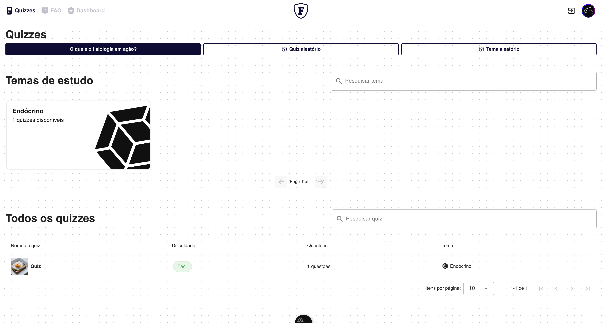

  

  <i>A full-stack quiz platform developed for the "Fisiologia em Ação" university extension project at UFPR.</i>

  

## About

**Fisiologia em Ação** is an interactive web application created for a physiology professor at the Federal University of Paraná (UFPR). It serves as an educational tool to help students test and improve their knowledge of physiology through dynamic quizzes.

**Techs**: `Vue`, `Nuxt`, `Vuetify`, `JavaScript`, `Laravel,` and `PHP`

  
Screenshots

  
  
  
  

## Team

Designed and developed in early 2024 by **Biomedical Informatics** students at UFPR. This undergraduate program integrates a core computer science curriculum with medical and biomedical applications, such as genetics and healthcare tech.

* [tuildes](https://github.com/tuildes)
* [PauloJankosz](https://github.com/PauloJankosz)
* [GAFS-GAFS](https://github.com/GAFS-GAFS)
* [felipeduuartee](https://github.com/felipeduuartee)
* [Guilherme-Eduardo](https://github.com/Guilherme-Eduardo)
* [mTh22k](https://github.com/mTh22k)
* [NicolasPedroso](https://github.com/NicolasPedroso)
* [ricardobacano](https://github.com/ricardobacano)
